# Operation V3 Genesis - Scavenger Hunt

An interactive web-based scavenger hunt designed for Vasion's V3 Company Kick-Off. Players navigate through a spy-themed journey learning about Vasion's products and digital transformation strategy.

## Game Overview

**Operation V3 Genesis** is a multi-act puzzle adventure where players take on the role of a secret agent working to eliminate legacy infrastructure vulnerabilities. The game teaches players about Vasion's core products and value propositions through progressive challenges involving cryptography, hidden clues, and technology concepts.

## Game Structure

The game consists of 4 acts with 16 phases total:

### ACT 1: The Rookie Agent (Infrastructure Elimination)
- **Focus**: Print server vulnerabilities and serverless printing
- **Phases**: 1-4
- **Key Concepts**: Single Point of Failure, PrintNightmare, SPI (Serverless Printing Infrastructure)

### ACT 2: The Field Agent (Digital Document Automation)
- **Focus**: Document workflow automation
- **Phases**: 5-8
- **Key Concepts**: Automated Indexing, Vasion Signature, PHI Patient Data, HIPAA compliance

### ACT 3: The Cryptographer (Zero Trust Security)
- **Focus**: Security architecture and authentication
- **Phases**: 9-12
- **Key Concepts**: Never Trust Always Verify, Secure Release Printing, Off-Network Printing

### ACT 4: The Handler (Output Management & AI)
- **Focus**: Cloud infrastructure and intelligent automation
- **Phases**: 13-16
- **Key Concepts**: AWS S3 Integration, Output Rules Routing, Reactive AI Agents

## How to Play

### Navigation
- Players navigate by **modifying the URL path** in their browser
- Paths are case-sensitive (e.g., `/Print Server/` not `/print server/`)
- Spaces are allowed in paths
- No clickable navigation menu - all progress is manual URL entry

### Finding Clues
Players must use various techniques to discover hidden clues:
- **View Page Source**: Right-click → "View Page Source" or `Ctrl+U` (Win) / `Cmd+Opt+U` (Mac)
- **Inspect Elements**: Right-click → "Inspect" or press `F12`
- **HTML Comments**: Look for `<!-- hidden messages -->`
- **Meta Tags**: Check HTML metadata for hidden information
- **CSS Inspection**: Find text with near-invisible colors
- **Audio Clues**: Listen to audio files (Morse code)
- **Images**: Inspect images for embedded text or QR codes

### Decryption Methods Used
- **Base64 Encoding**: Decode strings to reveal paths
- **Caesar Cipher**: Letter shifting (shift +5 in Phase 2)
- **Binary to ASCII**: Convert binary sequences to text
- **Vigenère Cipher**: Polyalphabetic substitution with key "S3"
- **Morse Code**: Audio signal decoding
- **URL Parameters**: Hidden query strings

## Game Flow Diagram

```mermaid
graph TD
    Start["/index.html<br/>Start Page"] --> Help["/help/index.html<br/>HTML Comment:<br/>'help page in obvious place'"]
    Start --> SecretAgent["/I am a secret agent/<br/>Decode from page hints"]
    
    SecretAgent --> |"Base64 decode:<br/>UHJpbnQgU2VydmVy"| PrintServer["/Print Server/<br/>Phase 1: Target Identified"]
    
    PrintServer --> |"Answer on page:<br/>Single Point of Failure"| SPOF["/Single Point of Failure/<br/>Phase 2: IT Burden<br/>Meta tag: 40%"]
    
    SPOF --> |"Caesar cipher +5:<br/>40 → 45"| Phase45["/45/<br/>Phase 3: 40% IT workload"]
    
    Phase45 --> |"Answer on page:<br/>PrintNightmare"| PrintNightmare["/PrintNightmare/<br/>Phase 4: CVE-2021-34527"]
    
    PrintNightmare --> |"Acrostic hint:<br/>S+P+I"| SPI["/SPI/<br/>Phase 5: Act 1 Complete<br/>Serverless Printing Infrastructure"]
    
    SPI --> |"Hint: OCR/data entry<br/>process"| AutoIndex["/Automated Indexing/<br/>Phase 6: OCR Technology"]
    
    AutoIndex --> |"Image contains:<br/>Vasion Signature"| Signature["/Vasion Signature/<br/>Phase 7: eSignatures"]
    
    Signature --> |"Base64 decode:<br/>UEhJIFBhdGllbnQgRGF0YQ=="| PHI["/PHI Patient Data/<br/>Phase 8: Act 2 Complete<br/>HIPAA Compliance"]
    
    PHI --> |"Binary to ASCII:<br/>never trust, always verify"| ZeroTrust["/Never Trust Always Verify/<br/>Phase 9: Zero Trust Mantra<br/>Audio clue plays"]
    
    ZeroTrust --> |"Morse code from audio:<br/>Secure Release Printing"| SecureRelease["/Secure Release Printing/<br/>Phase 10: Badge Authentication"]
    
    SecureRelease --> |"Vigenère cipher:<br/>Key: S3<br/>XNKYX QEMK = Corey Ercanbrack"| Corey["/Corey Ercanbrack/<br/>Phase 11: Act 3 Complete<br/>CTO Vision"]
    
    Corey --> |"JSON snippet shows:<br/>AWS + S3 + Integration"| AWS["/AWS S3 Integration/<br/>Phase 12: Cloud Foundation"]
    
    AWS --> |"Hint: Rules + Routing"| Output["/Output Rules Routing/<br/>Phase 13: Business Continuity"]
    
    Output --> |"Conway's Game of Life hint:<br/>Reactive AI stage"| Reactive["/Reactive AI Agents/<br/>Phase 14: AI Evolution"]
    
    Reactive --> |"Nearly invisible text:<br/>Eliminate Server Costs"| Eliminate["/Eliminate Server Costs/<br/>Phase 15: Final Mission"]
    
    Eliminate --> |"Navigate to final path"| Success["/V3 SUCCESS/<br/>Phase 16: Mission Complete"]
    
    Help --> |"Provides game mechanics<br/>and troubleshooting"| Start
    
    SecureRelease -.-> |"Dead end trap"| VPN["/I Need a VPN/"]
    VPN -.-> |"URL parameter escape:<br/>?solution=Off%20Network%20Printing"| OffNetwork["/Off Network Printing/<br/>Bonus: Remote printing"]
    OffNetwork -.-> Corey
    
    Start -.-> Stuck["/I Am Stuck/<br/>Generic help page"]
    Stuck -.-> Start
    
    classDef act1 fill:#ff6b6b,stroke:#ff0000,color:#fff
    classDef act2 fill:#ffaa00,stroke:#ff8800,color:#000
    classDef act3 fill:#00ffaa,stroke:#00ff88,color:#000
    classDef act4 fill:#00aaff,stroke:#0088ff,color:#fff
    classDef helper fill:#666,stroke:#999,color:#fff
    classDef success fill:#00ff00,stroke:#00ff00,color:#000
    
    class PrintServer,SPOF,Phase45,PrintNightmare,SPI act1
    class AutoIndex,Signature,PHI act2
    class ZeroTrust,SecureRelease,Corey act3
    class AWS,Output,Reactive,Eliminate act4
    class Help,Stuck,VPN,OffNetwork helper
    class Success success
```



## Key Puzzle Solutions

| Phase | Location | Clue Type | Solution |
|-------|----------|-----------|----------|
| Start | `/index.html` | HTML Comment | "help page in obvious place" → `/help/` |
| 1 | `/I am a secret agent/` | Base64 | `UHJpbnQgU2VydmVy` → "Print Server" |
| 2 | `/Print Server/` | Text on page | "Single Point of Failure" |
| 3 | `/Single Point of Failure/` | Meta tag + Caesar | `40` with shift +5 → `45` |
| 4 | `/45/` | Text hint | "PrintNightmare" vulnerability |
| 5 | `/PrintNightmare/` | Acrostic | **S**ecurity + **P**erformance + **I**nfrastructure = SPI |
| 6 | `/SPI/` | Concept hint | Automated data entry process = "Automated Indexing" |
| 7 | `/Automated Indexing/` | Image text | SVG contains "Vasion Signature" |
| 8 | `/Vasion Signature/` | Base64 | `UEhJIFBhdGllbnQgRGF0YQ==` → "PHI Patient Data" |
| 9 | `/PHI Patient Data/` | Binary | Convert binary → "never trust, always verify" |
| 10 | `/Never Trust Always Verify/` | Audio (Morse) | Morse code → "Secure Release Printing" |
| 11 | `/Secure Release Printing/` | Vigenère | Key "S3": `XNKYX QEMK RLYV RCMF` → "Corey Ercanbrack" |
| 12 | `/Corey Ercanbrack/` | JSON code | Partner + Service + Integration = "AWS S3 Integration" |
| 13 | `/AWS S3 Integration/` | Text pattern | Rules + Routing = "Output Rules Routing" |
| 14 | `/Output Rules Routing/` | Conway hint | AI stage 2 = "Reactive AI Agents" |
| 15 | `/Reactive AI Agents/` | Hidden text | Nearly invisible: "Eliminate Server Costs" |
| 16 | `/Eliminate Server Costs/` | Final path | Navigate to "/V3 SUCCESS/" |

## Technical Setup

### Requirements
- Web server (nginx, Apache, or similar)
- Static HTML hosting capability
- Support for spaces in URL paths

### Docker Deployment
```bash
docker-compose up -d
```

The game is configured to run on port 8080 using nginx.

### Local Development
Any static web server works:
```bash
# Python
python -m http.server 8080 --directory html

# Node.js
npx http-server html -p 8080
```

## Help System

Players who get stuck can:
1. Navigate to `/help/` for comprehensive game mechanics
2. Navigate to `/I am stuck/` for general hints
3. Email ryan.poppe@vasion.com for direct assistance (hidden in `/help/` page source)

## Educational Objectives

Players learn about:
- **Vasion Print**: Serverless printing infrastructure, eliminating print servers
- **Vasion Automate**: OCR, automated indexing, document workflows
- **Vasion Signature**: Electronic signatures, legal compliance
- **Security**: Zero Trust architecture, secure release printing, HIPAA compliance
- **Cloud Integration**: AWS S3, scalable storage
- **AI Evolution**: Reactive AI agents, intelligent automation
- **Business Value**: $10,000+ server cost elimination, 40% IT workload reduction

## Design Philosophy

- **No spoilers**: All clues require active investigation
- **Progressive difficulty**: Easy puzzles early, complex ciphers later
- **Multiple discovery methods**: Visual, audio, code inspection, cryptography
- **Educational storytelling**: Spy theme makes learning engaging
- **Real product knowledge**: All concepts tie to actual Vasion offerings

## Credits

Created for Vasion V3 Company Kick-Off
